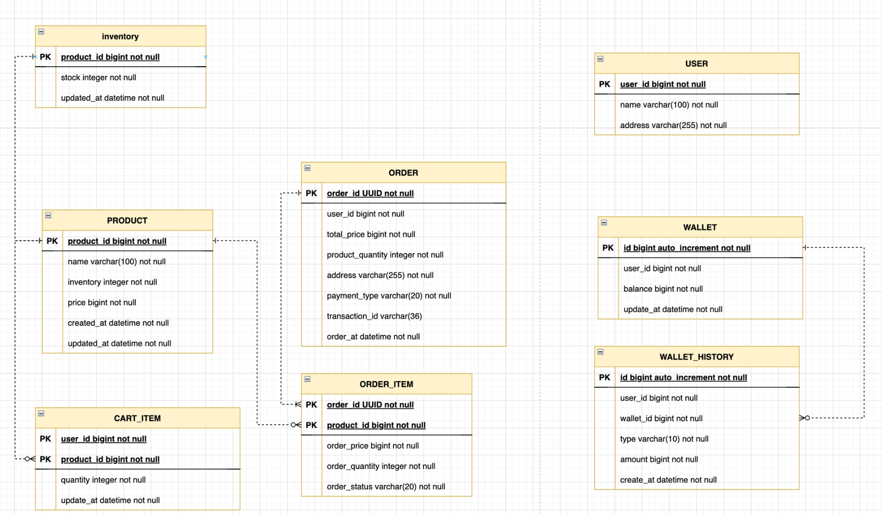

# E-Commerce Service 서버 구축

# Hanghae Plus Practice

### 프로젝트 개요 ✨

> [항해플러스 백엔드](https://hanghae99.spartacodingclub.kr/v2/plus/be?&utm_source=google&utm_medium=bs&utm_campaign=hhplus&utm_content=brand&utm_term=%ED%95%AD%ED%95%B4%ED%94%8C%EB%9F%AC%EC%8A%A4&gcl_keyword=%ED%95%AD%ED%95%B4%ED%94%8C%EB%9F%AC%EC%8A%A4&gcl_network=g&gad_source=1&gclid=Cj0KCQjwk6SwBhDPARIsAJ59Gwc6jHzEOp6MAN9Gf2EQ_5CtBQgSYich9YHnEgPYGWmf9HohEmYD7OcaAvahEALw_wcB)
> 4기 과제

### 목표 🚀

> E-Commerce 서비스를 제공하는 애플리케이션 구축  
> 요구사항을 분석하여 프로젝트 설계 및 개발 진행  
> 테스트 작성이 가능하고 유연한 아키텍처 구성

### Environment

- Spring Boot 3.2.4  
- Java 17  
- Gradle 8.7  
- JPA  
- JUnit + AssertJ  
- H2 Database  

---

# Milestone

# ERD

# API Spec