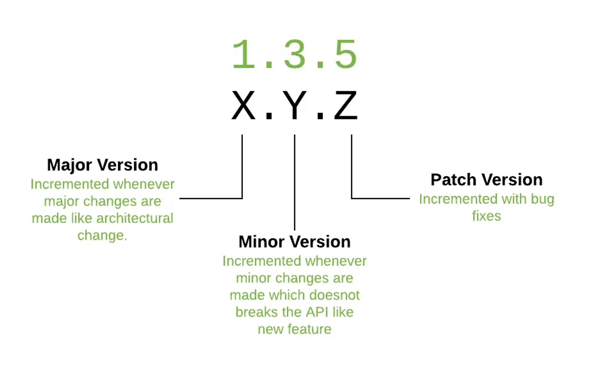

# E-Commerce Service 서버 구축

[](https://hits.seeyoufarm.com)

# Hanghae Plus Practice

### 프로젝트 개요 ✨

> [항해플러스 백엔드](https://hanghae99.spartacodingclub.kr/v2/plus/be?&utm_source=google&utm_medium=bs&utm_campaign=hhplus&utm_content=brand&utm_term=%ED%95%AD%ED%95%B4%ED%94%8C%EB%9F%AC%EC%8A%A4&gcl_keyword=%ED%95%AD%ED%95%B4%ED%94%8C%EB%9F%AC%EC%8A%A4&gcl_network=g&gad_source=1&gclid=Cj0KCQjwk6SwBhDPARIsAJ59Gwc6jHzEOp6MAN9Gf2EQ_5CtBQgSYich9YHnEgPYGWmf9HohEmYD7OcaAvahEALw_wcB)
> 4기 과제

### 목표 🚀

> E-Commerce 서비스를 제공하는 애플리케이션 구축  
> 요구사항을 분석하여 프로젝트 설계 및 개발 진행  
> 테스트 작성이 가능하고 유연한 아키텍처 구성

### Environment

- Spring Boot 3.2.4
- Java 17
- Gradle 8.7
- JPA
- JUnit + AssertJ
- H2 Database

---

# Milestone



# ERD


# API Spec

- 상품
  - [상품 조회 API](#상품-조회-api)
- 주문
  - [상품 주문 API](#상품-주문-api)
  - [상위 상품 조회 API](#상위-상품-조회-api)
- 사용자 지갑
  - [특정 사용자 잔액 조회 API](#특정-사용자-잔액-조회-api)
  - [특정 사용자 잔액 충전 API](#특정-사용자-잔액-충전-api)
- 장바구니
  - [장바구니 추가(수량 변경) API](#장바구니-추가수량-변경-api)
  - [장바구니 상품 삭제 API](#장바구니-상품-삭제-api)
  - [장바구니 상품 조회 API](#장바구니-상품-조회-api)

---

## 상품

### 상품 조회 API

- 요구사항
    - 상품 아이디로 상품 정보 및 잔여수량을 조회한다.

- 시퀀스 다이어그램
  ```mermaid
  sequenceDiagram
      actor client
      participant app as application
      participant product as database(product)
      participant inventory as database(inventory)
      client->>app: GET /products/{id}
      activate app
      
      app->>product: 상품 조회
      activate product
      alt has product
          product-->>app: 상품 데이터
        else has not product
            product-->>app: NotFoundException
            app-->>client: 400 bad request
           end
      deactivate product
      
      app->>inventory: 재고 조회(상품 id)
      activate inventory
      alt has inventory
          inventory-->>app: 상품 재고 데이터
        else has not inventory
            inventory-->>app: 재고 수량 0
           end
      deactivate inventory
      
      app-->>client: 200 OK<br>(재고가 포함된 상품 정보)
      
      deactivate app
  ```

<br/>

`Endpoint`

```
GET http://{server_url}/products/{id}
```

<br/>


`Request`

**Path Variable**

| 파라미터 | 타입      | 필수여부 | 설명     |
|------|---------|------|--------|
| id   | integer | Y    | 상품 아이디 |

`Response`

**Response Code**

- `200 OK`
- `400 bad request`

**Response body**

| 파라미터      | 타입      | 필수여부 | 설명     |
|-----------|---------|------|--------|
| productId | integer | Y    | 상품 아이디 |
| name      | string  | Y    | 상품 이름  |
| price     | integer | Y    | 상품 가격  |
| inventory | integer | Y    | 잔여수량   |

`프로세스`

- 상품 아이디로 상품 테이블에서 데이터 조회
    - 상품 아이디가 없을 경우 Exception 발생
    - 상품이 존재할 경우 `response`로 변환해서 반환함

`CURL`

```
curl --location --request GET 'http://localhost:8080/products/1'
```

---

## 주문

### 상품 주문 API

- 요구사항
    - 사용자 식별자와 (상품 ID, 수량) 목록을 입력받아 주문하고 결제를 수행
    - 결제는 기 충전된 잔액을 기반으로 수행하며 성공할 시 잔액을 차감해야 합니다.
    - 데이터 분석을 위해 결제 성공 시에 실시간으로 주문 정보를 데이터 플랫폼에 전송해야 합니다.

<br/>

`Endpoint`

```
POST http://{server_url}/orders
```

<br/>


`Request` **Request Body**

| 파라미터                   | 타입       | 필수여부 | 설명              |
|------------------------|----------|------|-----------------|
| userId                 | integer  | Y    | 사용자 아이디         |
| totalPrice             | integer  | Y    | 총 결제 금액         |
| paymentType            | string   | Y    | 결제 타입(`WALLET`) |
| orderAt                | datetime | Y    | 결제 일시           |
| orderItems             | Array    | Y    | 주문 상품 리스트       |
| orderItems[].productId | integer  | Y    | 상품 아이디          |
| orderItems[].price     | price    | Y    | 결제 금액           |
| orderItems[].quantity  | quantity | Y    | 결제 수량           |

`Response`

**Response Code**

- `200 OK`

`프로세스`

- 준문 상품별 재고 수량 감소
    - 남아있는 재고 수량을 초과하는 주문은 할 수 없다.
- 주문 요청에 총 결제 금액으로 지갑에서 차감 시도
    - 잔액이 부족하면 `Exception` 발생
- 성공일 경우 비동기(`@Async`)를 활용해 데이터 플랫폼에 결제 정보 전성
- `200` 응답

`CURL`

```
curl --location --request POST 'http://localhost:8080/orders' \
--header 'Content-Type: application/json' \
--data-raw '{
    "userId":1,
    "totalPrice":10000,
    "paymentType":"WALLET",
    "orderAt":"2024-04-04T15:24:54",
    "orderItems": [
        {
            "productId":1,
            "price":5000,
            "quantity":2
        },
        {
            "productId":2,
            "price":5000,
            "quantity":1
        }
    ]
}'

```

### 상위 상품 조회 API

- 요구사항
    - 최근 3일간 가장 많이 팔린 상위 5개 상품 정보를 제공하는 API 작성.
    - 나중에 추천 타입이 추가될 경우를 대비해서 추천타입 사용 : `type`
    - 순위에 따라서 오름차순으로 정렬 되어야 한다.

<br/>

`Endpoint`

```
GET http://{server_url}/orders/{type}
```

<br/>


`Request`

**Path Variable**

| 파라미터 | 타입     | 필수여부 | 설명                    |
|------|--------|------|-----------------------|
| type | string | Y    | 추천 타입(`RECOMMEND_01`) |

`Response`

**Response Code**

- `200 OK`

**Response body**

| 파라미터          | 타입      | 필수여부 | 설명     |
|---------------|---------|------|--------|
| [].rank       | integer | Y    | 순위     |
| [].productId  | integer | Y    | 상품 아이디 |
| [].price      | integer | Y    | 상품 가격  |
| [].orderCount | integer | Y    | 주문 수량  |

`프로세스`

- `type`별 추천 로직 실행
- 조회할때 캐시를 등록 (반복되는 Sql 쿼리 실행을 막음)
- 주문시 해당 캐시 키 삭제

`CURL`

```
curl --location --request GET 'http://localhost:8080/orders/RECOMMEND_01'

```

---

## 사용자 지갑

### 특정 사용자 잔액 조회 API

- 요구사항
    - 사용자 식별자를 통해 해당 사용자의 잔액을 조회한다.

<br/>

`Endpoint`

```
GET http://{server_url}/wallet/users/{id}
```

<br/>


`Request`

**Path Variable**

| 파라미터 | 타입      | 필수여부 | 설명      |
|------|---------|------|---------|
| id   | integer | Y    | 사용자 아이디 |

`Response`

**Response Code**

- `200 OK`

**Response body**

| 파라미터     | 타입      | 필수여부 | 설명          |
|----------|---------|------|-------------|
| userId   | integer | Y    | 사용자 아이디     |
| balance  | integer | Y    | 잔액          |
| updateAt | integer | N    | 마지막 업데이트 일시 |

`프로세스`

- 사용자 지갑 테이블 조회
- 만약 존재하지 않으면 잔액을 0으로 입력후 return
- 조회된 데이터 또는 0으로 입력된 객체 응답

`CURL`

```
curl --location --request GET 'http://localhost:8080/wallet/users/1'

```

### 특정 사용자 잔액 충전 API

- 요구사항
    - 사용자 식별자 및 충전할 금액을 받아 잔액 충전

<br/>

`Endpoint`

```
PATCH http://{server_url}/wallet/charge
```

<br/>


`Request`

**Request Body**

| 파라미터   | 타입      | 필수여부 | 설명      |
|--------|---------|------|---------|
| userId | integer | Y    | 사용자 아이디 |
| amount | integer | Y    | 충전 금액   |

`Response`

**Response Code**

- `200 OK`

`프로세스`

- 사용자 지갑 테이블 조회(해당 지갑에 `Lock` 사용)
- 지갑 데이터가 존재 할 경우
    - 사용자의 잔액에 입력받은 금액을 추가하여 `update`
- 데이터가 존재하지 않을 경우
    - 충전 금액으로 지갑 데이터 추가

`CURL`

```
curl --location --request PATCH 'http://localhost:8080/wallet/charge' \
--header 'Content-Type: application/json' \
--data-raw '{
    "userId":1,
    "amount":10000
}'

```

---

## 장바구니

### 장바구니 추가(수량 변경) API

- 요구사항
    - 사용자가 장바구니에 상품을 추가하는 API
    - 수량에 `0`이 들어올 경우 삭제를 한다.
    - 사용자별 상품은 하나만 장바구니에 추가 할 수 있다.

<br/>

`Endpoint`

```
PUT http://{server_url}/carts
```

<br/>


`Request`

**Request Body**

| 파라미터      | 타입       | 필수여부 | 설명        |
|-----------|----------|------|-----------|
| userId    | integer  | Y    | 사용자 아이디   |
| productId | integer  | Y    | 상품 아이디    |
| quantity  | integer  | Y    | 상품 수량     |
| eventAt   | datetime | Y    | 이벤트 발생 시간 |

`Response`

**Response Code**

- `200 OK`

`프로세스`

- 요청으로 들어온 장바구니 상품 수량을 저장
- 상품 수량이 `0`으로 들어올 경우 장바구니에서 데이터 삭제

`CURL`

```
curl --location --request PUT 'http://localhost:8080/carts' \
--header 'Content-Type: application/json' \
--data-raw '{
    "userId":1,
    "productId":1,
    "quantity":10,
    "eventAt":"2024-04-05T10:55:17"
}'
```

### 장바구니 상품 삭제 API

- 요구사항
    - 장바구니에 상품을 삭제하는

<br/>

`Endpoint`

```
DELETE http://{server_url}/carts/users/{userId}/products/{productId}
```

<br/>


`Request`

**Path Variable**

| 파라미터      | 타입      | 필수여부 | 설명      |
|-----------|---------|------|---------|
| userId    | integer | Y    | 사용자 아이디 |
| productId | integer | Y    | 상품 아이디  |

`Response`

**Response Code**

- `200 OK`

`프로세스`

- 사용자 아이디와 상품 아이디로 장바구니 테이블에 상품을 삭제한다.

`CURL`

```
curl --location --request DELETE 'http://localhost:8080/carts/users/1/products/1'
```

### 장바구니 상품 조회 API

- 요구사항
    - 특정 사용자의 장바구니에 담긴 상품을 조회
    - 조회할때 상품 이름과 가격도 같이 조회한다.

<br/>

`Endpoint`

```
GET http://{server_url}/carts/users/{userId}
```

<br/>


`Request`

**Path Variable**

| 파라미터   | 타입      | 필수여부 | 설명      |
|--------|---------|------|---------|
| userId | integer | Y    | 사용자 아이디 |

`Response`

**Response Code**

- `200 OK`

**Response body**

| 파라미터            | 타입       | 필수여부 | 설명          |
|-----------------|----------|------|-------------|
| [].productId    | integer  | Y    | 상품 아이디      |
| [].productName  | string   | Y    | 상품 이름       |
| [].quantity     | integer  | Y    | 장바구니 상품 수량  |
| [].price        | integer  | Y    | 상품 가격       |
| [].lastUpdateAt | datetime | Y    | 마지막 업데이트 일시 |

`프로세스`

- 사용자 아이디를 받아서 장바구니를 조회한다.
- 장바구니에 상품별로 이름과 가격을 상품 테이블에서 조회한다.
- 조회된 장바구니 데이터와 상품 데이터를 조합하여 응답한다.

`CURL`

```
curl --location --request GET 'http://localhost:8080/carts/users/1'
```

