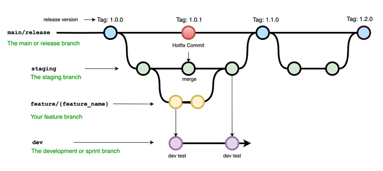
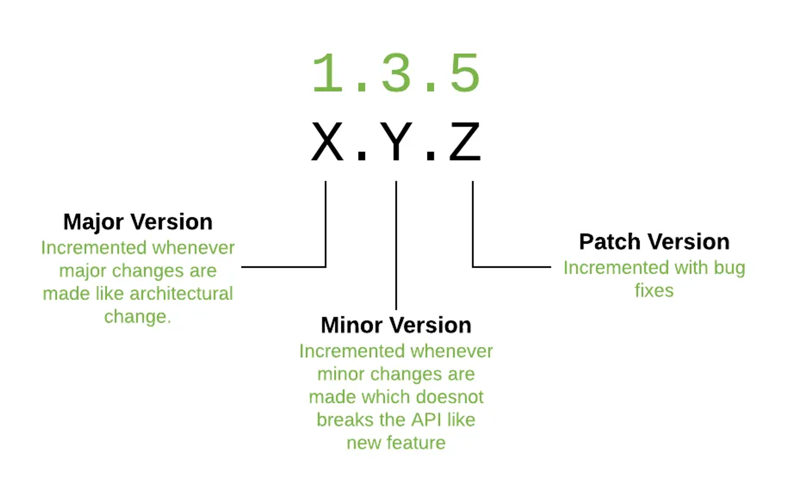

# Branch Convention

## 배포 flow

## 브랜치 이름 정의

### main
- 운영(`release`)에 마지막으로 배포된 버전으로 올라간다.

### release
- 운영 배포 브랜치, 버전별로 관리된다.
- `pull request`를 통해 배포 진행
- release note 작성.
- Semantic Versioning
  - `Major Release` : 새로운 기능이나 긴 기간을 두고 개발이 필요한 작업
  - `Minor Release` : 기존 기능을 개선하거나 몇주 내의 짧은 개발건 등의 작업
  - `Patch Release` : `patch`버전은 수시로 업데이트 되며, `Application`의 버그/패치 수정사항을 적용하는 경우 사용
  

### staging
- QA용 서버로 배포되는 브랜치
- `pull request`를 통해 배포 진행
- 운영서버와 같은 환경의 서버로 배포된다.

### dev
- 개발 서버에 대한 브랜치
- 개발자는 이 브랜치로 `push` 할 수 있으며 `dev`서버로 배포된다.

### feature/`{feature name}`
- 기능별로 만들어지고 기능 개발이 끝나면 삭제되는 브랜치

TODO
- aws 연동 및 배포 스크립트 작성
- 환경별 설정파일 관리
- checkstyle 적용 : checkstyleMain or sonarCloud
