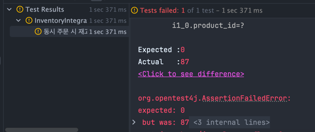
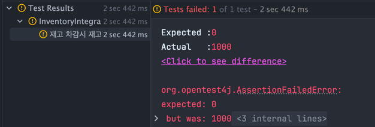
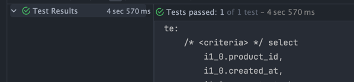

# 동시성 문제 처리

# 동시성이란?

여러 작업(스레드)이 공통된 한가지 자원에 동시에 접근하는 것

이런 상황에서 주로 발생하는 동시성 문제는 아래와 같다.

1. 경쟁 상태(Race Condition) : 두 개 이상의 스레드가 동시에 공유 자원에 접근하고 수정을 시도할 때 발생한다. 예상치 못한 결과가 발생(DB 일관성이 깨짐)하거나 잘못된 데이터를 조회할 수 있다.
2. 교착 상태(Deadlock) : 두 개 이상의 스레드가 서로 다른 자원을 기다리면서 대기하고 있는 상황을 말한다. 서로 다른 스레드가 소유한 자원을 기다리며 멈추어 있다.

# 이커머스 서비스에서 발생 할 수 있는 동시성 문제

1. 재고 갱신시 동시성 문제 : 여러 사용자가 동시에 상품을 구매할 경우, 재고 갱신 과정에서 동시성 문제가 발생할 수 있다. 10명의 사용자가 동시에 같은 상품을 구매할때 상품 재고가 5개밖에 없다면 5명의 사용자는 구매가 안되거나 환불 처리가 되야한다.
2. 포인트 사용시 동시성 문제 : 하나의 사용자 계정으로 여러 상품을 주문할 경우 포인트 차감 과정에서 동시성 문제가 발생할 수 있다. 잔고가 부족하면 주문이 실패해야한다.
3. 장바구니 추가 동시성 문제 : 만약 중복된 요청이 들어올 경우 들어온 순서대로 요청이 처리 되어야 한다.

# 동시성 문제 해결 방법

## Lock 사용
- Mysql을 사용할 경우 update을 할 때 베타락이 걸리게 된다. 베타락이 걸리게 되면 다른 트랜젝션에서 읽기/쓰기 작업 모두 불가능 함으로 update문으로 동시성 문제를 처리할 수 있다. 대신, 읽기와 쓰기 모두 락이 걸리기때문에 작업이 오래걸릴경우 다른 기능에서 해당 데이터를 읽을때 timeout이 발생할 수 있다.

- 낙관적 락
    - 충돌이 자주 일어나지 않을경우 적용 할 수 있다.
    - 동시 요청중 한건의 요청만 성공해야하는 케이스에 적합.
    - 데이터에 락을 거는것이 아닌 읽는 시점과 수정 시점의 version을 확인해서 동시성문제를 해결하는 방식으로 성능적으로 좋다고할 수 있다.
- 비관적 락
    - 충돌이 자주 일어날때 적용 할 수 있다.
    - 데이터베이스에 안정성을 부여하고 데이터의 일관성을 유지할 수 있다.
    - 데이터를 락을 걸어서 다른 트랜젝션에서 접근이 불가능하기 때문에 만약 해당 데이터가 여러 기능에서 사용하고 있다면 요청에 대한 응답시간이 길어질 수 있다. -> 응답시간이 길어지면 해당 서비스를 사용하는 고객의 이탈이 발생하게 된다.
- 분산 락
    - 분산 환경에서 여러 서버나 클라이언트간에 락을 공유해서 동시성 문제를 해결 할 수 있다.
    - Redis의 Redisson을 통해 락을 획득하고 반납하면서 처리할 수 있다.
    - DB가 아닌 redis를 사용함으로써 DB에 부하가 적어진다.


# 재고 차감 테스트 진행

## 테스트 시나리오
- 상품 100개 추가
- 101명이 동일한 상품 구매
- 재고는 0이 되고 실패한 주문이 한개가 존재해야한다.

```java
void inventory_concurrency_test() throws Exception {
    // given
    long productId = 1L;
    int numberOfThreads = 101;
    ExecutorService executorService = Executors.newFixedThreadPool(numberOfThreads);
    CountDownLatch latch = new CountDownLatch(numberOfThreads);

    // when - 주문
    ConcurrentLinkedQueue<Integer> failedOrder = new ConcurrentLinkedQueue<>();
    for (int i = 0; i < numberOfThreads; i++) {
      int finalI = i;
      executorService.execute(() -> {
        try {
          OrderItemRequest request = new OrderItemRequest(
              1L,
              1L,
              1
          );

          inventoryService.orderItemDeduction(request);

        } catch (Exception e) {
          failedOrder.add(finalI);
        }
        latch.countDown();
      });
    }

    latch.await();
    // then
    ProductResponse productResponse = getProductResponse(productId);
    assertThat(productResponse.stock()).isZero();
    assertThat(failedOrder).hasSize(1);
}
```
- 결과


- 상품 개수가 남아있으면 안되는데 87개가 남아있다.


## 낙관적락 적용
- 락을 적용할 entity에 version을 추가하고 사용하는 메서드에 Lock 어노테이션을 적용한다.
```java
// entity
//....
@Version
private Long version;
//....

// JpaRepository
@Lock(LockModeType.OPTIMISTIC)
Optional<Inventory> findByProductId(Long productId);

```

- 재고가 하나도 감소하지 않았다.


---
## 비관적락 사용

- version을 사용하지 않고 Lock 어노테이션만 적용해서 사용할 수 있다.

```java
// JpaRepository
@Lock(LockModeType.PESSIMISTIC_READ)
Optional<Inventory> findByProductId(Long productId);
```

- 테스트가 성공한 걸 볼 수 있다.
