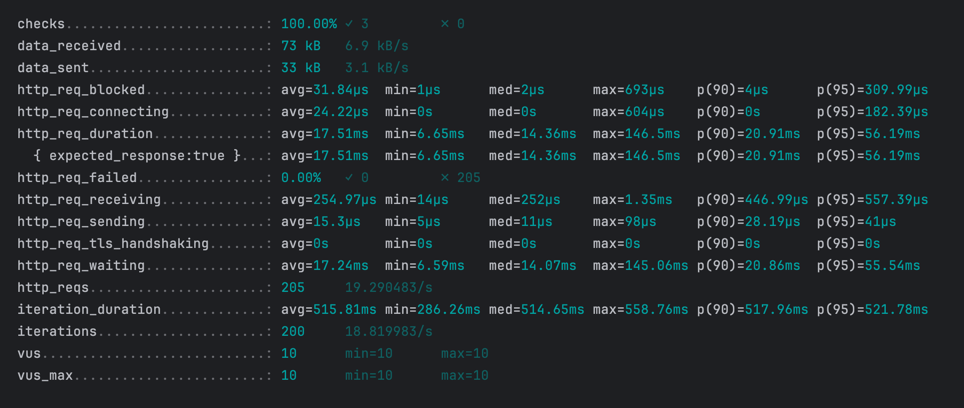
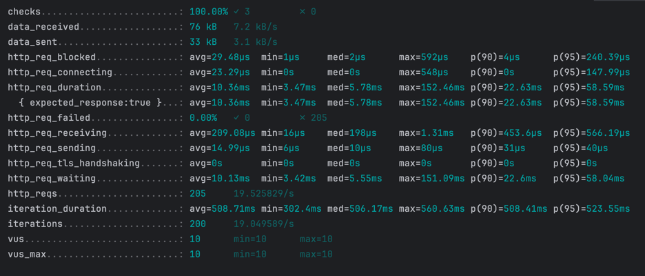
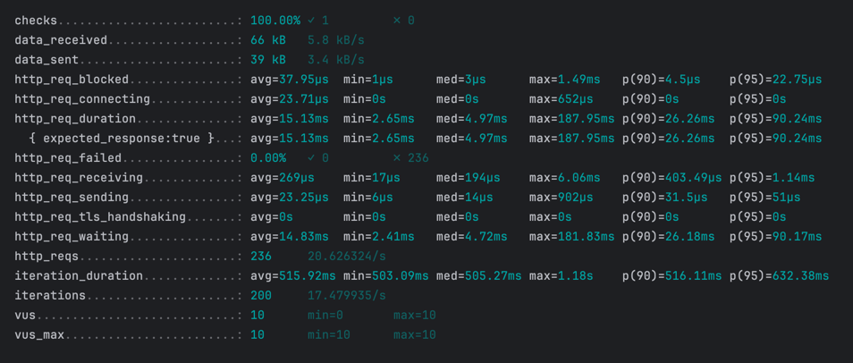
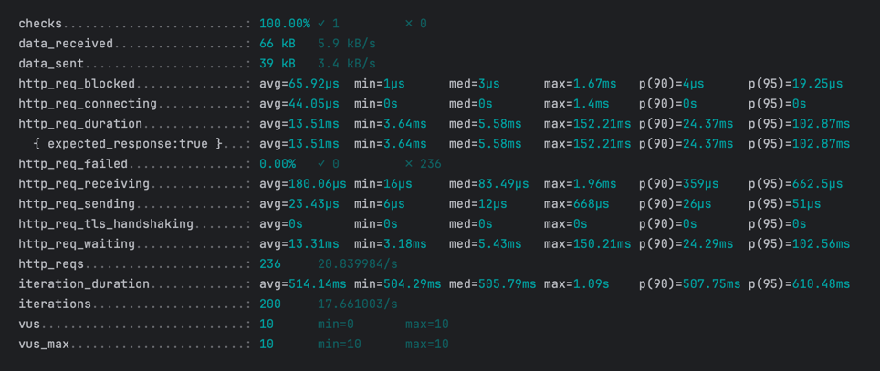
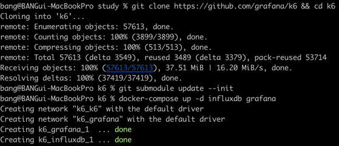
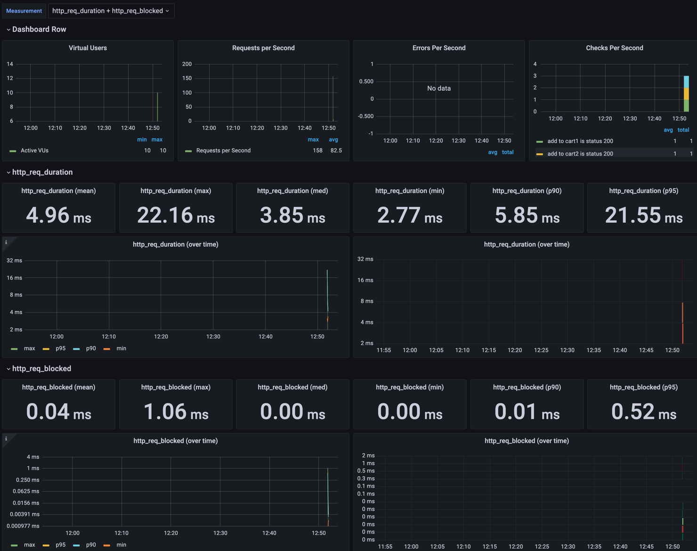

# 부하 테스트 대상 선정 및 목적
- 장바구니 조회
  - 조회 시 캐시사용 전과 후 성능을 비교한다.
- 상위 상품 조회
  - 인덱스 및 캐시 설정 전과 후를 비교한다.

## 장바구니 조회 테스트

- AS-IS

- TO-BE(캐시 추가)

## 상위 상품 조회 테스트

- 캐시 & 인덱스 적용 안함

- TO-BE

# 모니터링

## grafana
- `influxDB`와 `grafana`를 사용해서 k6의 테스트 결과를 모니터링 해본다.

- 위에서 만든 k6 스크립트를 아래 명령어로 실행하고 `2587` id 로 dashboard를 만들면 결과를 확인 할 수 있다.

### 참고
- https://yeon-dev.tistory.com/203
- https://ttl-blog.tistory.com/1366?category=1027645